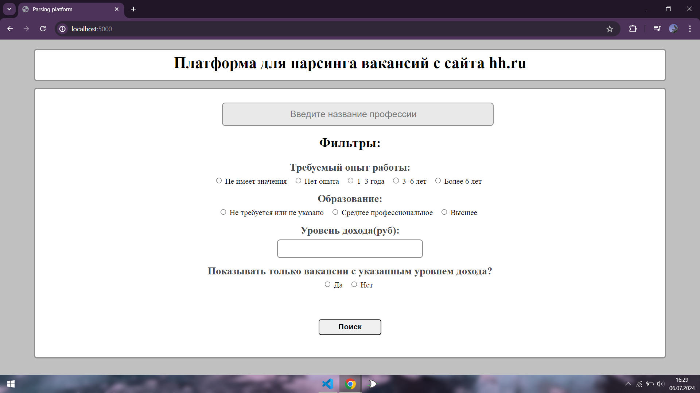
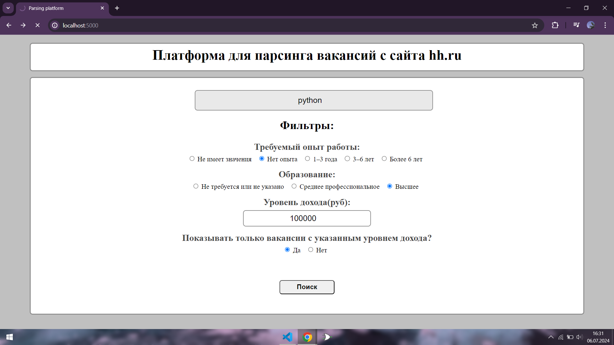
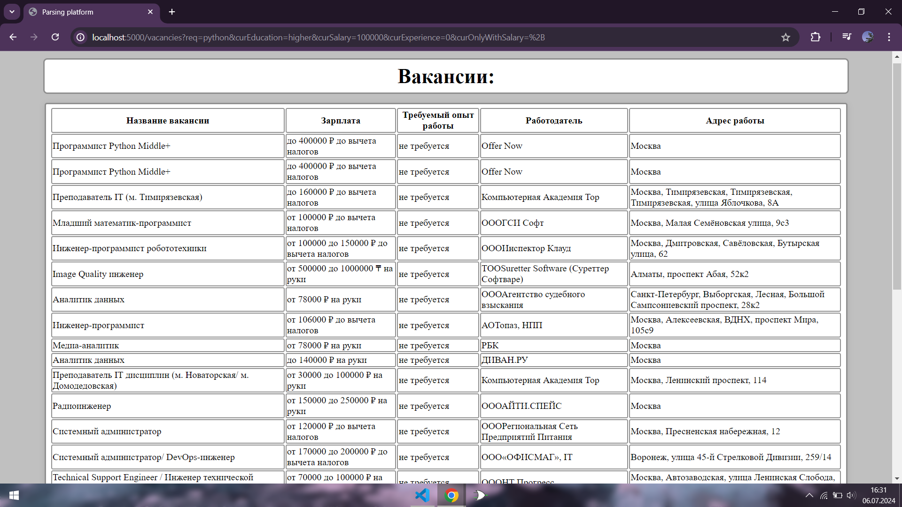
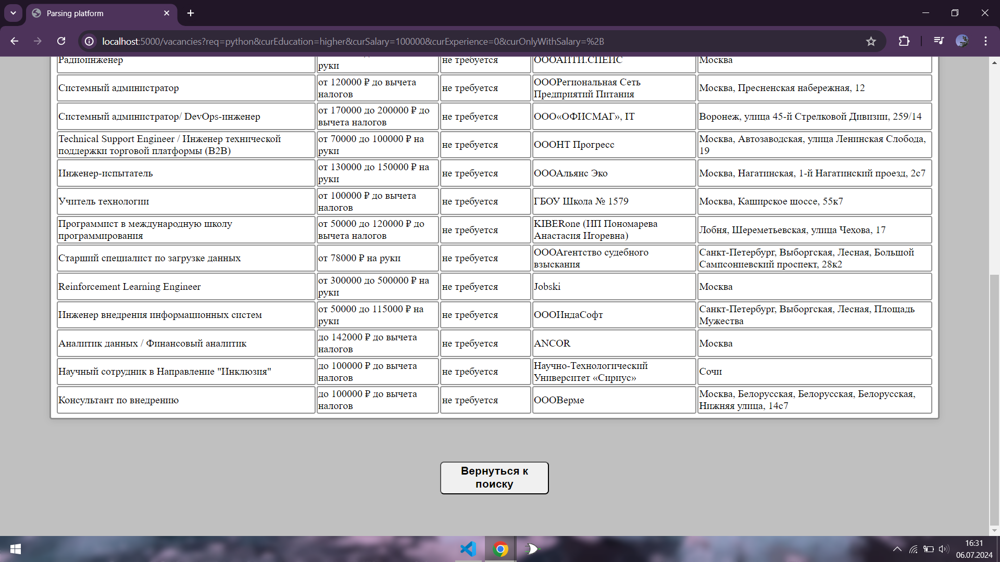

Учебная практика
---------------------------------------------------------------------------------------------------------------------------------------
Для начала введите в терминал команду `git clone https://github.com/Temka02/Parsing-platform.git`
Затем, убедившись, что вы находитесь в корневой папке проекта, введите в терминал команду: `docker-compose up --build`
После перейдите по адресу localhost:5000 и окажетесь на сайте

Далее для поиска вакансий вам необходимо ввести название вакансии, выбрать опыт работы, образование, ввести желаемую зарплату и выбрать хотите вы просмотреть объявления только с указанной зарплатой или же нет, затем нажать на кнопку "Поиск"

После этого вы получите список вакансий, удовлетворяющих вашему запросу с дополнительными данными:

Если захотите, то сможете вернуться на главную страницу при нажатии на кнопку "Вернуться к поиску" и продолжить поиск
